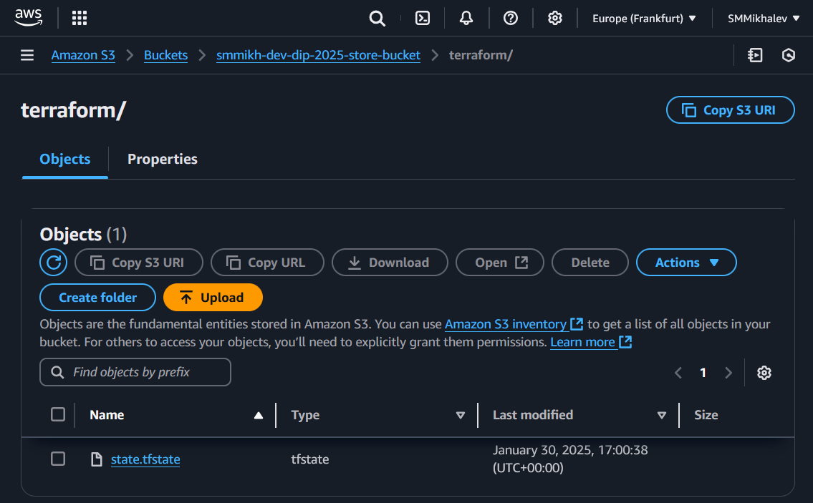
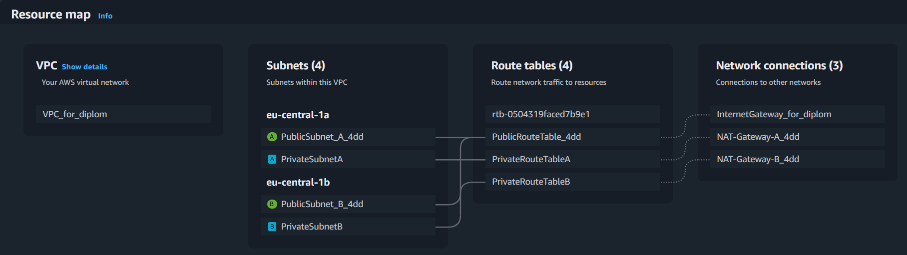
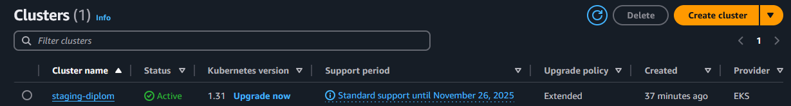
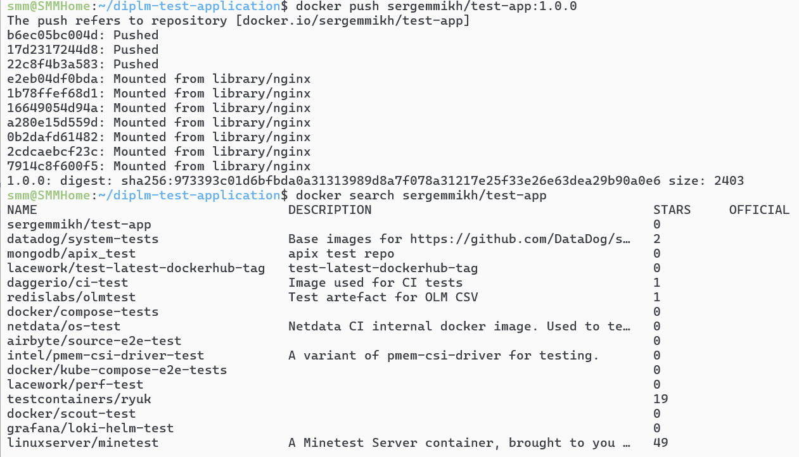
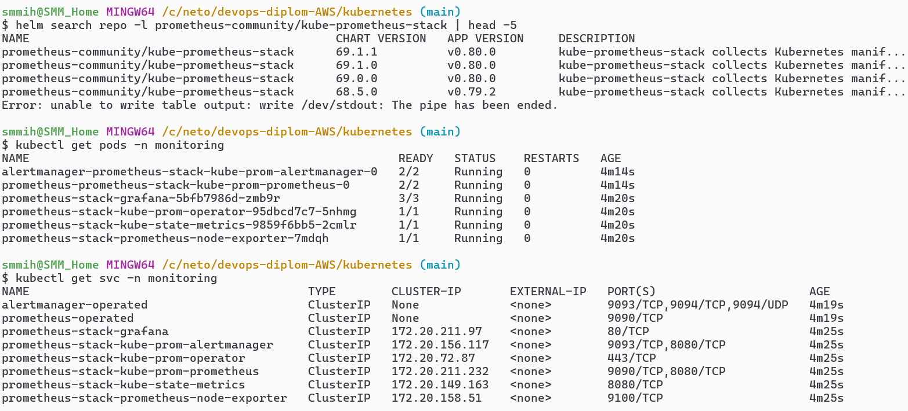
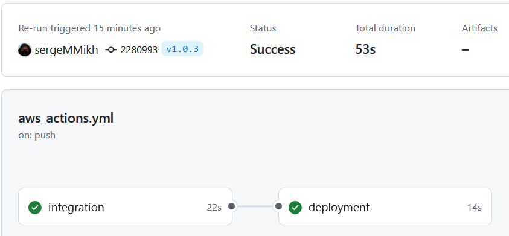

# **Diploma Practicum in AWS - Sergey Mikhalev**

## **Goals:**

1. Prepare a cloud infrastructure based on AWS.
2. Deploy and configure a Kubernetes cluster.
3. Install and configure a monitoring system.
4. Configure and automate the build of a test application using Docker containers.
5. Set up CI for automatic building and testing.
6. Set up CD for automatic application deployment.

---

## **Implementation Steps:**

### **Creating Cloud Infrastructure**

To begin, prepare the cloud infrastructure in AWS using [Terraform](https://www.terraform.io/).

#### **Execution Details:**

- The AWS budget is limited, so keep this in mind when designing infrastructure and using resources.
- For self-hosted Kubernetes, minimize VM resources and CPU allocation. Use **spot instances** for worker nodes in both cloud and self-hosted options.

#### **Preliminary Setup for Kubernetes Cluster Deployment:**

1. Create a service account for Terraform to manage infrastructure with necessary permissions (avoid superuser rights).
2. Prepare a [backend](https://www.terraform.io/docs/language/settings/backends/index.html) for Terraform:
   - **Recommended:** S3 bucket in AWS (create via Terraform)
   - **Alternative:** [Terraform Cloud](https://app.terraform.io/)
3. Configure Terraform to use the created bucket as a backend for state storage.
4. Create a VPC with subnets in different availability zones.
5. Ensure that `terraform destroy` and `terraform apply` can be executed without manual intervention.
6. If using [Terraform Cloud](https://app.terraform.io/), verify that changes apply successfully via the web interface.

#### **Expected Results:**

1. Terraform is configured, allowing infrastructure deployment without manual steps, and the state file is stored in S3 or Terraform Cloud.
2. The initial infrastructure configuration is ready, but changes may be required during further implementation.

---

## **Solution**

To follow the project's decomposition requirement, the following directories were created:

- **[bootstrap](terraform/bootstrap):** Contains essential resources for the infrastructure.
  - **[iam](terraform/bootstrap/modules/iam/)** - IAM role configuration module.
  - **[s3](terraform/bootstrap/modules/s3/)** - Backend storage setup module.

- **[infrastructure](terraform/infrastructure):** Contains additional modules:
  - **[ec2](terraform/infrastructure/modules/ec2/)** - EC2 instance configuration.
  - **[vpc](terraform/infrastructure/modules/vpc/)** - VPC and subnet configuration.
  - **[security_group](terraform/infrastructure/modules/security_group/)** - Network security setup.
  - **[eks](terraform/infrastructure/modules/eks/)** - Elastic Kubernetes Service (EKS) configuration.
  - **[load_balancer](terraform/infrastructure/modules/load_balancer/)** - Load balancer setup.

---

### **Kubernetes Cluster Deployment**

The goal is to create a [Kubernetes](https://kubernetes.io/) cluster using the pre-configured infrastructure.

#### **Implementation Options:**

1. **Recommended Option:** Self-hosted Kubernetes cluster setup.
   - Use Terraform to create at least **three** virtual machines for the cluster.
   - Prepare [Ansible](https://www.ansible.com/) configurations using [Kubespray](https://kubernetes.io/docs/setup/production-environment/tools/kubespray/).
   - Deploy Kubernetes on the created instances.

2. **Alternative Option:** Use [AWS Elastic Kubernetes Service (EKS)](https://aws.amazon.com/eks/).
   - Create an **EKS cluster** with node groups spread across three availability zones.

#### **Expected Results:**

1. A fully operational Kubernetes cluster.
2. The `~/.kube/config` file contains access credentials.
3. The command `kubectl get pods --all-namespaces` executes successfully.

---

### **Test Application Deployment**

To proceed with the next step, a test application simulating a production application is required.

#### **Implementation:**

1. **Recommended Approach:**
   - Create a **separate Git repository** with an **Nginx-based** static web server.
   - Prepare a **Dockerfile** for building the application image.

2. **Alternative Approach:**
   - Use any other code, ensuring it includes a **Dockerfile**.

#### **Expected Results:**

1. A **Git repository** with the test application and Dockerfile.
2. A **Docker registry** with the built image (DockerHub or AWS ECR).

#### **Solution:**

A test application repository was created: [GitHub](https://github.com/sergeMMikh/diplm-test-application).

---

### **Monitoring System Deployment**

#### **Goal:**

1. Deploy **Prometheus**, **Grafana**, **Alertmanager**, and **Node Exporter**.
2. Deploy the test application (Nginx static server).

#### **Implementation:**

- Installed **metrics-server** on the cluster.
- Used **Helm** to deploy **prometheus-stack**.
- Configured **Ingress** for external access.
- Configured **A-records** for domain *crystalpuzzles.pt*.

#### **Solution:**

- Test Application: [http://app.crystalpuzzles.pt/app](http://app.crystalpuzzles.pt/app)
- Grafana: [http://grafana.crystalpuzzles.pt/](http://grafana.crystalpuzzles.pt/)
- Prometheus: [http://prometheus.crystalpuzzles.pt/](http://prometheus.crystalpuzzles.pt/)

---

### **CI/CD Setup**

#### **Goal:**

1. Automatically build and push Docker images upon commits.
2. Automatically deploy updated images.

#### **Solution:**

In the [test application repository](https://github.com/sergeMMikh/diplm-test-application), a [GitHub Actions](https://github.com/features/actions) workflow was created under `.github/workflows`:

---

### **Final Results**

1. [Terraform Repository](terraform)
2. Fully automated CI/CD pipeline.
3. [DockerHub Repository](https://hub.docker.com/repository/docker/sergemmikh/test-app/general)
4. [Kubernetes Configuration Repository](kubernetes/manifests)
5. Deployed Services:
   - **Test Application:** [http://app.crystalpuzzles.pt/app](http://app.crystalpuzzles.pt/app)
   - **Grafana:** [http://grafana.crystalpuzzles.pt/](http://grafana.crystalpuzzles.pt/) (admin / prom-operator)

