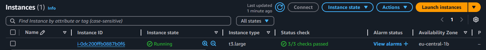

# Дипломный практикум в Yandex.Cloud - Сергей Михалёв.

## Цели:

1. Подготовить облачную инфраструктуру на базе облачного провайдера Яндекс.Облако.
2. Запустить и сконфигурировать Kubernetes кластер.
3. Установить и настроить систему мониторинга.
4. Настроить и автоматизировать сборку тестового приложения с использованием Docker-контейнеров.
5. Настроить CI для автоматической сборки и тестирования.
6. Настроить CD для автоматического развёртывания приложения.

---
## Этапы выполнения:


### Создание облачной инфраструктуры

Для начала необходимо подготовить облачную инфраструктуру в ЯО при помощи [Terraform](https://www.terraform.io/).

Особенности выполнения:

- Бюджет купона ограничен, что следует иметь в виду при проектировании инфраструктуры и использовании ресурсов;
Для облачного k8s используйте региональный мастер(неотказоустойчивый). Для self-hosted k8s минимизируйте ресурсы ВМ и долю ЦПУ. В обоих вариантах используйте прерываемые ВМ для worker nodes.

Предварительная подготовка к установке и запуску Kubernetes кластера.

1. Создайте сервисный аккаунт, который будет в дальнейшем использоваться Terraform для работы с инфраструктурой с необходимыми и достаточными правами. Не стоит использовать права суперпользователя
2. Подготовьте [backend](https://www.terraform.io/docs/language/settings/backends/index.html) для Terraform:  
   а. Рекомендуемый вариант: S3 bucket в созданном ЯО аккаунте(создание бакета через TF)
   б. Альтернативный вариант:  [Terraform Cloud](https://app.terraform.io/)
3. Создайте конфигурацию Terrafrom, используя созданный бакет ранее как бекенд для хранения стейт файла. Конфигурации Terraform для создания сервисного аккаунта и бакета и основной инфраструктуры следует сохранить в разных папках.
4. Создайте VPC с подсетями в разных зонах доступности.
5. Убедитесь, что теперь вы можете выполнить команды `terraform destroy` и `terraform apply` без дополнительных ручных действий.
6. В случае использования [Terraform Cloud](https://app.terraform.io/) в качестве [backend](https://www.terraform.io/docs/language/settings/backends/index.html) убедитесь, что применение изменений успешно проходит, используя web-интерфейс Terraform cloud.

Ожидаемые результаты:

1. Terraform сконфигурирован и создание инфраструктуры посредством Terraform возможно без дополнительных ручных действий, стейт основной конфигурации сохраняется в бакете или Terraform Cloud
2. Полученная конфигурация инфраструктуры является предварительной, поэтому в ходе дальнейшего выполнения задания возможны изменения.

---
**Решение**

Согласно требованию декомпозиции проекта создал деректории:
- [bootstrap](terraform/bootstrap) для размещения ключевых ресурсов, без которых не сможет работать остальная инфраструктура и которые должны разворачиваться в первую очередь. После выполнения bootstrap может больше не изменяться (или меняться очень редко): 
   - [iam](terraform/bootstrap/modules/iam/)- модуль для натсройки сервисной роли 
   - [s3](terraform/bootstrap/modules/s3/)- модуль настройки базового backend хранилища. 
 
- [infrastructure](terraform/infrastructure) для размещения остальных модулей:
   - [ec2](terraform/infrastructure/modules/ec2/)- модуль инстансов
   - [vpc](terraform/infrastructure/modules/vpc/)- сети
   - [sequrity_group](terraform/infrastructure/modules/security_group/)- настройка сетевого взаимодеёствия инстансов.
   - [eks](terraform\infrastructure\modules\eks)- Elastic Kubernetes Service- альтернативное решение для развёртки кластера.
   - [load_balancer](terraform\infrastructure\modules\load_balancer)- балансировщик нагрузки кластера.

При помощи записи *backend "s3"* в файле [*backend.tf*](terraform/infrastructure/backend.tf) настроил сохранение *terraform.tfstate* в s3 bucket.</br>


Сргоасно 6-му пункту заданияиспользуя web-интерфейс AWS убедился что все изменения `terraform destroy` и `terraform apply` проходят успешно.</br>
Карта VPC с тремя разными зонами доступности. Использую только один NAT в целях экономии.</br>
</br>
Сервисные роли *staging-diplom-eks-nodes* и *staging-diplom-eks-cluster*</br>
</br>

---
### Создание Kubernetes кластера

На этом этапе необходимо создать [Kubernetes](https://kubernetes.io/ru/docs/concepts/overview/what-is-kubernetes/) кластер на базе предварительно созданной инфраструктуры.   Требуется обеспечить доступ к ресурсам из Интернета.

Это можно сделать двумя способами:

1. Рекомендуемый вариант: самостоятельная установка Kubernetes кластера.  
   а. При помощи Terraform подготовить как минимум 3 виртуальных машины Compute Cloud для создания Kubernetes-кластера. Тип виртуальной машины следует выбрать самостоятельно с учётом требовании к производительности и стоимости. Если в дальнейшем поймете, что необходимо сменить тип инстанса, используйте Terraform для внесения изменений.  
   б. Подготовить [ansible](https://www.ansible.com/) конфигурации, можно воспользоваться, например [Kubespray](https://kubernetes.io/docs/setup/production-environment/tools/kubespray/)  
   в. Задеплоить Kubernetes на подготовленные ранее инстансы, в случае нехватки каких-либо ресурсов вы всегда можете создать их при помощи Terraform.
2. Альтернативный вариант: воспользуйтесь сервисом [Yandex Managed Service for Kubernetes](https://cloud.yandex.ru/services/managed-kubernetes)  
  а. С помощью terraform resource для [kubernetes](https://registry.terraform.io/providers/yandex-cloud/yandex/latest/docs/resources/kubernetes_cluster) создать **региональный** мастер kubernetes с размещением нод в разных 3 подсетях      
  б. С помощью terraform resource для [kubernetes node group](https://registry.terraform.io/providers/yandex-cloud/yandex/latest/docs/resources/kubernetes_node_group)
  
Ожидаемый результат:

1. Работоспособный Kubernetes кластер.
2. В файле `~/.kube/config` находятся данные для доступа к кластеру.
3. Команда `kubectl get pods --all-namespaces` отрабатывает без ошибок.

**Решение**

*kubespray*

В соответствии с рекомендациями задания я пробовал использовать для поднятия кластера *kubespray*. К сожалею, по независящим от меня причинам, полученный кластер оказался неустойчив, и я решил что он непригоден для следующих этапов дипломной работы. Эту ситуацию я описал в отдельной ветке *kubespray* в [README.md](https://github.com/sergeMMikh/devops-diplom-AWS/blob/kubespray/README.md). Было решено воспользоваться вторым способом установки кластера.


*EKS*

AWS предоставляет решение *Elastic Kubernetes Service* его я решил использовтаь далее.

В модуле [*eks*](terraform/infrastructure/modules/eks/) есть полное описание этого сервиса. Учитывая предыдущий опыт я не стал использовтаь самый слабый (а значит- дешёвый) тип инстанса. Для узлов я выбрал стратегию "меньше нодов, больше мощность". Что бы следовать требованиям задания я оставил возможность повышения количсвта нод до 3 в случае пиковой нагрузки:

```
capacity_type  = "SPOT"
  instance_types = ["t3.large"]

  scaling_config {
    desired_size = 1
    max_size     = 3
    min_size     = 1
  }
```

В результате запуска terraform поднялся кластер</br>
</br>

В качестке ноды поднялась виртуальная машина соответствующего типа в рамках одной из доступных зон.</br>
</br>

Создалась *Auto Scaling group*</br>
</br>
</br>

Произвёл первоначальную настройку *aws eks cli*</br>
</br>


---
### Создание тестового приложения

Для перехода к следующему этапу необходимо подготовить тестовое приложение, эмулирующее основное приложение разрабатываемое вашей компанией.

Способ подготовки:

1. Рекомендуемый вариант:  
   а. Создайте отдельный git репозиторий с простым nginx конфигом, который будет отдавать статические данные.  
   б. Подготовьте Dockerfile для создания образа приложения.  
2. Альтернативный вариант:  
   а. Используйте любой другой код, главное, чтобы был самостоятельно создан Dockerfile.

Ожидаемый результат:

1. Git репозиторий с тестовым приложением и Dockerfile.
2. Регистри с собранным docker image. В качестве регистри может быть DockerHub или [Yandex Container Registry](https://cloud.yandex.ru/services/container-registry), созданный также с помощью terraform.

**Решение**

Создал [git репозиторий](https://github.com/sergeMMikh/diplm-test-application) для тестового приложения.

Структура приложения:
```
$ tree
.
├── Dockerfile
├── images
│   └── murz.jpg
├── index.html
└── nginx.conf
```

Собрал Dоcker образ и отправил на DockerHub в [репоиторий](https://hub.docker.com/repository/docker/sergemmikh/test-app/general).</br>
</br>

---
### Подготовка cистемы мониторинга и деплой приложения

Уже должны быть готовы конфигурации для автоматического создания облачной инфраструктуры и поднятия Kubernetes кластера.  
Теперь необходимо подготовить конфигурационные файлы для настройки нашего Kubernetes кластера.

Цель:
1. Задеплоить в кластер [prometheus](https://prometheus.io/), [grafana](https://grafana.com/), [alertmanager](https://github.com/prometheus/alertmanager), [экспортер](https://github.com/prometheus/node_exporter) основных метрик Kubernetes.
2. Задеплоить тестовое приложение, например, [nginx](https://www.nginx.com/) сервер отдающий статическую страницу.

Способ выполнения:
1. Воспользоваться пакетом [kube-prometheus](https://github.com/prometheus-operator/kube-prometheus), который уже включает в себя [Kubernetes оператор](https://operatorhub.io/) для [grafana](https://grafana.com/), [prometheus](https://prometheus.io/), [alertmanager](https://github.com/prometheus/alertmanager) и [node_exporter](https://github.com/prometheus/node_exporter). Альтернативный вариант - использовать набор helm чартов от [bitnami](https://github.com/bitnami/charts/tree/main/bitnami).

2. Если на первом этапе вы не воспользовались [Terraform Cloud](https://app.terraform.io/), то задеплойте и настройте в кластере [atlantis](https://www.runatlantis.io/) для отслеживания изменений инфраструктуры. Альтернативный вариант 3 задания: вместо Terraform Cloud или atlantis настройте на автоматический запуск и применение конфигурации terraform из вашего git-репозитория в выбранной вами CI-CD системе при любом комите в main ветку. Предоставьте скриншоты работы пайплайна из CI/CD системы.

Ожидаемый результат:
1. Git репозиторий с конфигурационными файлами для настройки Kubernetes.
2. Http доступ на 80 порту к web интерфейсу grafana.
3. Дашборды в grafana отображающие состояние Kubernetes кластера.
4. Http доступ на 80 порту к тестовому приложению.

**Решение**

Установка сервиса метрик (*metrics-server*) на кластер.</br>
</br>

используя *helm* установил *prometheus-stack* из *prometheus-community*.</br>
</br>

Написал [*deployment*](kubernetes/manifests/test-app-deployment.yaml) [*service*](kubernetes/manifests/test-app-service.yaml) для деплоя приложения.

С *grafana* возникли небольште трудности, пришлось добавить отдельный [сервис](kubernetes/manifests/grafana-service.yaml) для работы с 3000 портом.

Итоговый список сервисов.</br>
</br>

Для проброса сервисов в интерернет написал [*ingfess*](kubernetes/manifests/aws-alb-ingress.yaml). Получил внешнее DNS имя.</br>
</br> 

*load balancer* в трёх зонах доступности.</br>
</br> 

Сделал соответсвующие А-записи для своего домена *crystalpuzzles.pt*.</br>
</br> </br>
</br> 

В итоге сервисы доступны по адресам:
- тестовое приложение: *http://app.crystalpuzzles.pt/app*
- grafana: *http://grafana.crystalpuzzles.pt/*
- prometheus: *http://prometheus.crystalpuzzles.pt/*
</br>

</br> 
</br> 
</br> 


---
### Установка и настройка CI/CD

Осталось настроить ci/cd систему для автоматической сборки docker image и деплоя приложения при изменении кода.

Цель:

1. Автоматическая сборка docker образа при коммите в репозиторий с тестовым приложением.
2. Автоматический деплой нового docker образа.

Можно использовать [teamcity](https://www.jetbrains.com/ru-ru/teamcity/), [jenkins](https://www.jenkins.io/), [GitLab CI](https://about.gitlab.com/stages-devops-lifecycle/continuous-integration/) или GitHub Actions.

Ожидаемый результат:

1. Интерфейс ci/cd сервиса доступен по http.
2. При любом коммите в репозиторие с тестовым приложением происходит сборка и отправка в регистр Docker образа.
3. При создании тега (например, v1.0.0) происходит сборка и отправка с соответствующим label в регистри, а также деплой соответствующего Docker образа в кластер Kubernetes.

**Решение**

В [репозитории с тестовым приложением](https://github.com/sergeMMikh/diplm-test-application) создал папку [*.github/workflows*](https://github.com/sergeMMikh/diplm-test-application/tree/main/.github/workflows) с описание шагов:
- *integration*- автоматическая сборка образа приложения и его отправка в репозиторий [DockerHub](https://hub.docker.com) *sergemmikh/test-app*
- *deployment*: обновление образа в поде *test-app* моего кластера *diplom-claster*

Согласно задани, обновление должно происходить только при появлении нового *tag* в репозитории. За это отвечает директива
```
on:
  push:
      tags:        
      - '*'
```
Процесс выполнения pipline:</br> 
</br>

История обновления development до и после работы pipline:</br> 
</br>


---
## Итог

1. [Репозиторий с конфигурационными файлами Terraform](terraform).

2. Процесс выполнения pipline:</br> 

3. Репозиторий с конфигурацией ansible, если был выбран способ создания Kubernetes кластера при помощи отсутствует, остались только файлы переменных [my-values.yaml](kubernetes\my-values.yaml) и [values.yaml](kubernetes\values.yaml). Полное описание процесса и причин отказа от kubespray можно найти в [README.md](https://github.com/sergeMMikh/devops-diplom-AWS/blob/kubespray/README.md)
4. [Репозиторий с Dockerfile](https://hub.docker.com/repository/docker/sergemmikh/test-app/general) тестового приложения и [ссылка на собранный docker image](https://hub.docker.com/repository/docker/sergemmikh/test-app/tags/v1.0.3/sha256-d54a08b6a6cedb32799d2d20b9f2eda74f0e3a8fa36dc1f562f960273537d966).
5. [Репозиторий с конфигурацией Kubernetes кластера](kubernetes\manifests).
6. Ссылки на [тестовое приложение](http://app.crystalpuzzles.pt/app) и [веб интерфейс Grafana](http://grafana.crystalpuzzles.pt/). Данные доступа:
- user: admin
- password: prom-operator.
7. Все репозитории рекомендуется хранятся на одном ресурсе [github](https://github.com/sergeMMikh).
