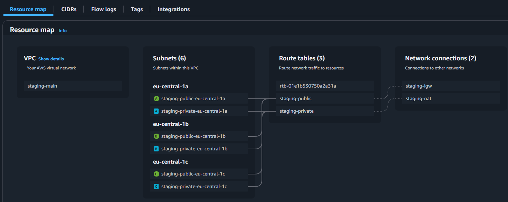
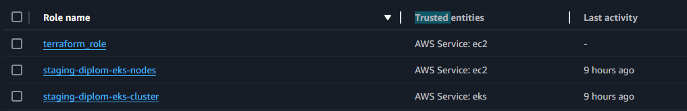

# **Diploma Practicum in AWS - Sergey Mikhalev**

## **Goals:**

1. Prepare a cloud infrastructure based on AWS.
2. Deploy and configure a Kubernetes cluster.
3. Install and configure a monitoring system.
4. Configure and automate the build of a test application using Docker containers.
5. Set up CI for automatic building and testing.
6. Set up CD for automatic application deployment.

---
## **Implementation Steps:**

### **Creating Cloud Infrastructure**

To begin, prepare the cloud infrastructure in AWS using [Terraform](https://www.terraform.io/).

#### **Execution Details:**

- The AWS budget is limited, so keep this in mind when designing infrastructure and using resources.
- Use **spot instances** for worker nodes in both cloud and self-hosted options.

#### **Preliminary Setup for Kubernetes Cluster Deployment:**

1. Create a service account for Terraform to manage infrastructure with necessary permissions.
2. Prepare a [backend](https://www.terraform.io/docs/language/settings/backends/index.html) for Terraform:
   - **Recommended:** S3 bucket in AWS (create via Terraform)
   - **Alternative:** [Terraform Cloud](https://app.terraform.io/)
3. Configure Terraform to use the created bucket as a backend for state storage.
4. Create a VPC with subnets in different availability zones.
5. Ensure that `terraform destroy` and `terraform apply` can be executed without manual intervention.
6. If using [Terraform Cloud](https://app.terraform.io/), verify that changes apply successfully via the web interface.

#### **Expected Results:**

1. Terraform is configured, allowing infrastructure deployment without manual steps.
2. The initial infrastructure configuration is ready, but changes may be required during further implementation.

---
## **Solution**

**Project Structure:**

- **[bootstrap](terraform/bootstrap):** Contains essential resources for the infrastructure.
  - **[iam](terraform/bootstrap/modules/iam/)** - IAM role configuration module.
  - **[s3](terraform/bootstrap/modules/s3/)** - Backend storage setup module.

- **[infrastructure](terraform/infrastructure):** Contains additional modules:
  - **[ec2](terraform/infrastructure/modules/ec2/)** - EC2 instance configuration.
  - **[vpc](terraform/infrastructure/modules/vpc/)** - VPC and subnet configuration.
  - **[security_group](terraform/infrastructure/modules/security_group/)** - Network security setup.
  - **[eks](terraform/infrastructure/modules/eks/)** - Elastic Kubernetes Service (EKS) configuration.
  - **[load_balancer](terraform/infrastructure/modules/load_balancer/)** - Load balancer setup.

**Backend Configuration:**

Using *backend "s3"* in [*backend.tf*](terraform/infrastructure/backend.tf), Terraform state is stored in an S3 bucket.

Verified via AWS web interface that `terraform destroy` and `terraform apply` execute successfully.

**VPC Configuration:**

**IAM Roles Created:**

---
### **Kubernetes Cluster Deployment**

The goal is to create a [Kubernetes](https://kubernetes.io/) cluster using the pre-configured infrastructure.

#### **Implementation Options:**

1. **Recommended Option:** Self-hosted Kubernetes cluster setup.
   - Use Terraform to create at least **three** virtual machines for the cluster.
   - Prepare [Ansible](https://www.ansible.com/) configurations using [Kubespray](https://kubernetes.io/docs/setup/production-environment/tools/kubespray/).
   - Deploy Kubernetes on the created instances.

2. **Alternative Option:** Use [AWS Elastic Kubernetes Service (EKS)](https://aws.amazon.com/eks/).
   - Create an **EKS cluster** with node groups spread across three availability zones.

#### **Expected Results:**

1. A fully operational Kubernetes cluster.
2. The `~/.kube/config` file contains access credentials.
3. The command `kubectl get pods --all-namespaces` executes successfully.

**EKS Deployment:**

**EKS Node Configuration:**

**Auto Scaling Group:**

**EKS CLI Configuration:**

---
### **Test Application Deployment**

#### **Solution:**

A test application repository was created: [GitHub](https://github.com/sergeMMikh/diplm-test-application).

---
### **Monitoring System Deployment**

#### **Solution:**

- Installed **metrics-server** on the cluster.

- Used **Helm** to deploy **prometheus-stack**.

- Configured **Ingress** for external access.

- Configured **A-records** for domain *crystalpuzzles.pt*.

- Load Balancer across three availability zones.

#### **Deployed Services:**

- **Test Application:** [http://app.crystalpuzzles.pt/app](http://app.crystalpuzzles.pt/app)
- **Grafana:** [http://grafana.crystalpuzzles.pt/](http://grafana.crystalpuzzles.pt/)
- **Prometheus:** [http://prometheus.crystalpuzzles.pt/](http://prometheus.crystalpuzzles.pt/)

**Service List:**

---
### **CI/CD Setup**

#### **Solution:**

In the [test application repository](https://github.com/sergeMMikh/diplm-test-application), a [GitHub Actions](https://github.com/features/actions) workflow was created under `.github/workflows`:

**Pipeline Execution:**

**Deployment Process:**

---
### **Final Results**

1. [Terraform Repository](terraform)
2. Fully automated CI/CD pipeline.
3. [DockerHub Repository](https://hub.docker.com/repository/docker/sergemmikh/test-app/general)
4. [Kubernetes Configuration Repository](kubernetes/manifests)
5. Deployed Services:
   - **Test Application:** [http://app.crystalpuzzles.pt/app](http://app.crystalpuzzles.pt/app)
   - **Grafana:** [http://grafana.crystalpuzzles.pt/](http://grafana.crystalpuzzles.pt/) (admin / prom-operator)

